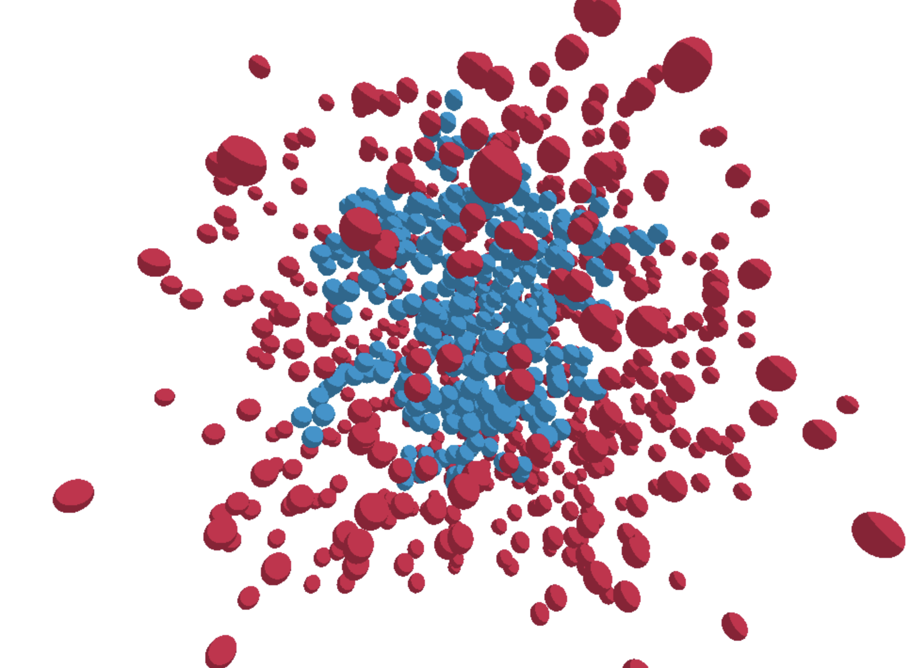

# Morphogenesis

Experiments with morphogenesis.

THREE.js and paper.js is used for rendering.

___

**Example output**:

> Differential growth in 2D

 
 

> Render  of the implementation of diffusion-limited aggregation in 3D.

My entry to this topic was through [@jasonwebb's compilation of resources](https://github.com/jasonwebb/morphogenesis-resources). Shout out for a great list of resources.